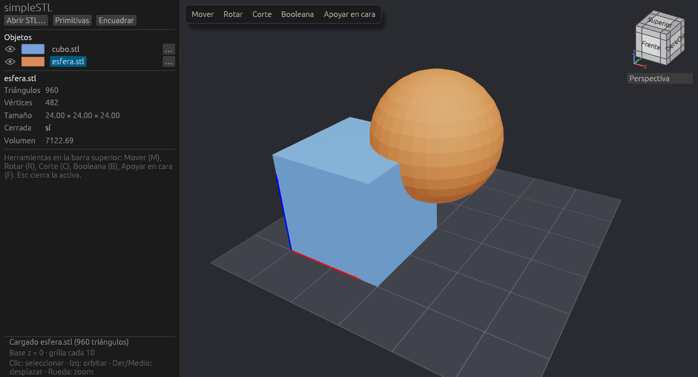

# simpleSTL

Visor y editor sencillo de archivos STL escrito en Rust. Permite cargar varias
piezas, moverlas y rotarlas, cortarlas con un plano, combinarlas con operaciones
booleanas, apoyarlas sobre una de sus caras y crear primitivas (cubo, esfera,
cilindro, cono).

La interfaz está inspirada en PrusaSlicer y FreeCAD: una barra de herramientas
sobre el visor, un cubo de navegación y un panel lateral con la lista de objetos.



## Funciones

- **Visor 3D** con órbita tipo tornamesa, desplazamiento y zoom, cubo de vista con
  26 vistas, proyección en perspectiva u ortogonal y una base translúcida con grilla
  en z = 0.
- **Deshacer y rehacer** cualquier cambio (Ctrl+Z / Ctrl+Y).
- **Objetos**: abrir varios STL, mostrar u ocultar, cambiar el color, renombrar,
  clonar, exportar a STL y eliminar.
- **Selección** con un clic en la vista 3D.
- **Herramientas** (una activa a la vez):
  - **Mover** y **Rotar** con un manipulador por eje.
  - **Corte** con un plano que se desplaza e inclina gráficamente. Las dos mitades
    quedan cerradas.
  - **Booleana**: unión, resta e intersección entre dos objetos.
  - **Apoyar en cara**: resalta las caras planas estables. Al hacer clic en una, la
    pieza queda apoyada en el suelo y alineada con los ejes.
- **Primitivas** paramétricas cuyas dimensiones se pueden editar después de crearlas.
- **Diagnóstico y reparación de mallas**: indica si la malla es cerrada (condición
  necesaria para cortes y booleanas) o tiene normales invertidas. *Reparar malla*
  suelda vértices, quita triángulos duplicados, orienta las caras, cierra agujeros y
  fusiona en un solo sólido las piezas que se tocan o se superponen.

## Requisitos

- Rust 1.92 o superior.
- CMake, un compilador de C++ y git, para compilar [Manifold](https://github.com/elalish/manifold).
- OpenGL 3.3.
- En Linux, `xdg-desktop-portal`, para los diálogos de abrir y guardar archivos.
- En Linux, para compilar: `pkg-config` y las cabeceras de Wayland (`libwayland-dev`
  en Debian/Ubuntu).

## Compilar

Manifold, el motor de booleanas y cortes, está en C++. El crate que lo envuelve lo
compila con paralelismo ilimitado, y en un equipo con 8 GB de RAM eso agota la
memoria. Por eso Manifold se compila una sola vez, aparte y con 2 procesos:

```sh
scripts/build-manifold.sh        # deja las librerías en third_party/manifold-lib
cargo build --release
```

`.cargo/config.toml` ya apunta a esas librerías con `MANIFOLD_CSG_LIB_DIR`. Si el
equipo tiene poca memoria, conviene además limitar la compilación de Rust:

```sh
systemd-run --user --scope -p MemoryMax=4500M -p MemorySwapMax=0 cargo build --release
```

## Uso

```sh
cargo run --release -- samples/cubo.stl samples/esfera.stl
```

`samples/cubo_roto.stl` es un cubo con una cara faltante y un triángulo invertido,
para probar la reparación.

Los archivos pasados como argumentos se abren al iniciar. También se pueden abrir
con **Abrir STL…**.

| Acción | Control |
|---|---|
| Orbitar | Arrastrar con el botón izquierdo |
| Desplazar | Arrastrar con el botón derecho o central |
| Zoom | Rueda |
| Seleccionar / deseleccionar | Clic sobre un objeto / en el vacío |
| Mover, Rotar, Corte, Booleana, Apoyar en cara | M, R, C, B, F |
| Cerrar la herramienta | Esc |
| Deshacer / rehacer | Ctrl+Z / Ctrl+Y (o Ctrl+Shift+Z) |
| Alternar perspectiva / ortogonal | O |
| Clonar | Ctrl+D |
| Eliminar el objeto seleccionado | Supr |
| Pasos fijos al arrastrar el manipulador | Mantener Ctrl |

La guía completa está en [docs/guia-de-uso.md](docs/guia-de-uso.md).

## Tests

```sh
cargo test
```

Cubren la lectura de STL, la topología y el volumen, las booleanas, los cortes, la
envolvente convexa, la búsqueda de caras para apoyar y su alineación, las
primitivas, los nombres de las copias, el historial de deshacer y la reparación de
mallas.

## Documentación

- [Guía de uso](docs/guia-de-uso.md): cada herramienta paso a paso.
- [Arquitectura](docs/arquitectura.md): módulos, flujo de un cuadro y algoritmos.

## Dependencias principales

| Crate | Uso |
|---|---|
| [three-d](https://crates.io/crates/three-d) 0.19 | Ventana, renderizado OpenGL, selección de objetos (picking) |
| egui 0.34 (vía three-d) | Interfaz |
| [manifold3d](https://crates.io/crates/manifold3d) 0.4 | Booleanas, cortes, envolvente convexa, primitivas |
| [transform-gizmo-egui](https://crates.io/crates/transform-gizmo-egui) 0.9 | Manipulador 3D |
| [stl_io](https://crates.io/crates/stl_io) 0.11 | Lectura y escritura de STL |
| [rfd](https://crates.io/crates/rfd) 0.17 | Diálogos de archivo |
